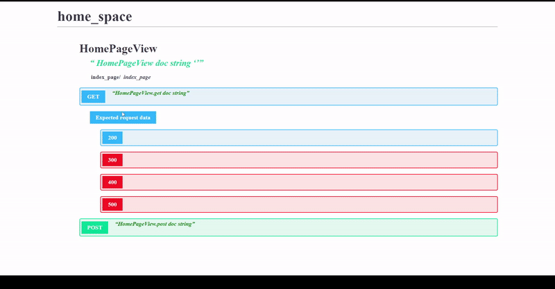

# ApyWy - аналог Swagger

Основную проблему, которую решает *ApyWy* - большое количество времени разработчика для написания схемы (*schema*) для класса *View*. В моей версии мы можем использовать обычные питоновские словари для обозначения ожидаемых данные и ожидаемого ответа.

## Пример не настроенной версии apywy:

## Пример настроенной версии apywy:


## Установка

1. Добавляем в *settings.INSTALLED_APPS*:

```python
INSTALLED_APPS = [
    ...
    'apywy.api',
    ...
]
```

2. Добавляем в _urls.py_ главного приложения:

```python
path('apywy/', include(('apywy.api.urls', 'apywy.api'), namespace='apywy')),
```

3. **Готово**, на главной странице _ApyWy_ - ***/apywy/***  есть вся возможная информация без дополнительных настроек.

## Настройка

По умолчанию, все что мы можем узнать для джанго-вьюшки:

- Url-путь до _http-метода_.
- Док-стринг для вьюшки, а также для всех ее _http-методов_ (_get_, _post_, ...).

Но мы можем это исправить, построив _ApyWy_ схему для вьюшки.

Наш файл *views.py*:
```python
# views.py
class HomePageView(APIView):
    '''
    HomePageView doc string 
    '''

    def get(self, request, some_quary):
        'HomePageView.get doc string'

        if some_quary == 'some value':
            return Response({'ANSWER': 'GET-INVALID-RESULT'}, status=status.HTTP_500_INTERNAL_SERVER_ERROR)
        return Response({'ANSWER': 'GET-RESULT'}, status=status.HTTP_200_OK)

    def post(self, request):
        'HomePageView.post doc string'
        return Response({'ANSWER': 'POST-RESULT'}, status=status.HTTP_201_CREATED)
```

* Создаем файл *apywy_schemas.py* (имя не важно)
```python
# apywy_schemas.py
from apywy.fields import HttpStatusField, HttpMethodField
from apywy.schema import Schema


class HomePageSchema(Schema):

    class GET(HttpMethodField):

        HTTP_200 = HttpStatusField(
            expected_response_data={'ANSWER': 'GET-RESULT'},
        )

        HTTP_500 = HttpStatusField(
            expected_response_data={'ANSWER': 'GET-INVALID-RESULT'},
            comment='wrong query arg',
        )
```
* Навешиваем эту схему на view:
```python
# views.py
...
from apywy.decorators import set_apywy_schema

from .apywy_schemas import HomePageSchema


@set_apywy_schema(HomePageSchema)
class HomePageView(APIView):
    ...
```
Итог, для метода **get** мы получили расширенную информацию.
* Добавим информацию про **post**
```python
# apywy_schemas.py
...

class HomePageSchema(Schema):
    ...

    class POST(HttpMethodField):

        HTTP_201 = HttpStatusField(
            expected_response_data={'ANSWER': 'POST-RESULT'}
        ) 

        class META:
            expected_request_data = {'data': 'some data here'}
```
По итогу, конечный вариант нашей схемы:
```python
# apywy_schemas.py
from apywy.fields import HttpStatusField, HttpMethodField
from apywy.schema import Schema


class HomePageSchema(Schema):

    class GET(HttpMethodField):

        HTTP_200 = HttpStatusField(
            expected_response_data={'ANSWER': 'GET-RESULT'},
        )

        HTTP_500 = HttpStatusField(
            expected_response_data={'ANSWER': 'GET-INVALID-RESULT'},
            comment='wrong query arg',
        )

    class POST(HttpMethodField):

        HTTP_201 = HttpStatusField(
            expected_response_data={'ANSWER': 'POST-RESULT'}
        ) 

        class META:
            expected_request_data = {'data': 'some data here'}
```
<!-- TODO добавить тут итоговую картинку  -->

---

По умолчанию на главной странице мы видим вьюшки до всех путей, кроме тех, которые относятся к неймспейсам:

```python
('apywy', 'admin')
```

Если вы хотите игнорировать дополнительные неймспейсы, то укажите это в *settings.NAMESPACES_TO_IGNORE*:

```python
NAMESPACES_TO_IGNORE = ()  # значение по умолчанию

NAMESPACES_TO_IGNORE = ('app', )  # игнорировать namespace с именем "app"

NAMESPACES_TO_IGNORE = ('*', )  # игнорировать все неймспейсы
```

### TODO:
* Не везде сейчас есть комментарии
* Рефакторить index.js
